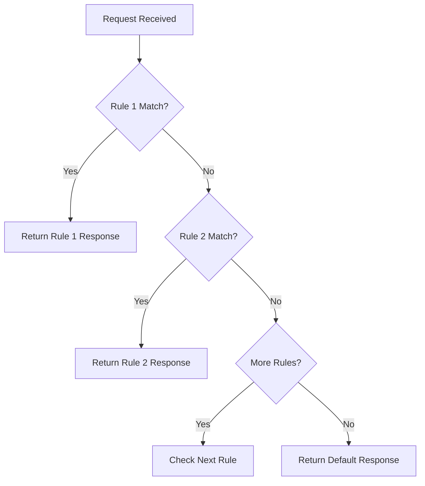

## Overview

Response Rules allow your bin to return different responses based on incoming request properties. This is useful for:

- Testing different API scenarios
- Simulating error conditions
- Mocking authentication flows
- A/B testing webhook handlers

## How It Works

When a request arrives, rules are evaluated in **priority order** (lowest number first). The first matching rule determines the response. If no rules match, the bin's default response is used.



## Creating Rules

### Via Dashboard

1. Open your bin
2. Navigate to **"Response Rules"** tab
3. Click **"Add Rule"**
4. Configure conditions and response
5. Click **"Save"**

### Via API

Response rules are updated by patching the bin configuration.

```bash
curl -X PATCH https://curlme.io/api/bins/abc123xyz \
  -H "x-api-key: cm_your_api_key" \
  -H "Content-Type: application/json" \
  -d '{
    "rules": [
      {
        "name": "Auth Error",
        "enabled": true,
        "priority": 1,
        "conditions": {
          "header": {
            "key": "authorization",
            "value": ""
          }
        },
        "response": {
          "statusCode": 401,
          "headers": {},
          "body": "{\"error\": \"unauthorized\"}",
          "contentType": "application/json"
        }
      }
    ]
  }'
```

<Warning>
  When updating rules via API, the `rules` array you provide replaces all existing rules for that bin.
</Warning>

## Rule Structure

```json
{
  "id": "rule_123",
  "name": "Human-readable name",
  "enabled": true,
  "priority": 1,
  "conditions": {
    "method": "POST",
    "path": "/webhooks",
    "header": { "key": "x-api-key", "value": "test" },
    "query": { "key": "debug", "value": "true" }
  },
  "response": {
    "statusCode": 200,
    "headers": { "X-Debug": "enabled" },
    "body": "{\"debug\": true}",
    "contentType": "application/json"
  }
}
```

## Condition Types

### Method Matching

Match specific HTTP methods:

```json
{
  "conditions": {
    "method": "POST"
  }
}
```

Supported values: `GET`, `POST`, `PUT`, `PATCH`, `DELETE`, `OPTIONS`, `HEAD`

### Path Matching

Match request paths:

```json
{
  "conditions": {
    "path": "/api/v1/users"
  }
}
```

<Note>
  Path matching is case-sensitive and matches the exact path.
</Note>

### Header Matching

Match header key-value pairs:

```json
{
  "conditions": {
    "header": {
      "key": "content-type",
      "value": "application/xml"
    }
  }
}
```

Common use cases:
- Authentication: `authorization: Bearer invalid`
- Content negotiation: `accept: application/xml`
- Custom headers: `x-api-version: 2`

### Query Parameter Matching

Match query string parameters:

```json
{
  "conditions": {
    "query": {
      "key": "environment",
      "value": "staging"
    }
  }
}
```

Example URL: `https://curlme.io/h/abc123?environment=staging`

## Combining Conditions

All specified conditions must match (AND logic):

```json
{
  "conditions": {
    "method": "POST",
    "path": "/webhooks/stripe",
    "header": {
      "key": "stripe-signature",
      "value": ""
    }
  }
}
```

This rule matches:
- ✅ `POST /webhooks/stripe` without `stripe-signature` header
- ❌ `GET /webhooks/stripe` without `stripe-signature` header
- ❌ `POST /webhooks/github` without `stripe-signature` header

## Priority

Rules are evaluated in ascending priority order:

| Priority | Rule Name | Action |
| -------- | --------- | ------ |
| 1 | Missing Auth | Return 401 |
| 2 | Invalid Token | Return 403 |
| 3 | Rate Limited | Return 429 |
| 10 | Success | Return 200 |

<Tip>
  Use low numbers (1-10) for error conditions and higher numbers (50-100) for success cases.
</Tip>

## Examples

### Authentication Testing

```json
{
  "name": "Missing API Key",
  "priority": 1,
  "conditions": {
    "header": { "key": "x-api-key", "value": "" }
  },
  "response": {
    "statusCode": 401,
    "body": "{\"error\": \"api_key_required\"}",
    "contentType": "application/json"
  }
}
```

### Content Type Negotiation

```json
{
  "name": "XML Response",
  "priority": 5,
  "conditions": {
    "header": { "key": "accept", "value": "application/xml" }
  },
  "response": {
    "statusCode": 200,
    "body": "<?xml version=\"1.0\"?><response><status>ok</status></response>",
    "contentType": "application/xml"
  }
}
```

### Debug Mode

```json
{
  "name": "Debug Enabled",
  "priority": 10,
  "conditions": {
    "query": { "key": "debug", "value": "true" }
  },
  "response": {
    "statusCode": 200,
    "headers": { "X-Debug-Mode": "enabled" },
    "body": "{\"debug\": true, \"timestamp\": \"{{timestamp}}\"}",
    "contentType": "application/json"
  }
}
```

### Simulate Errors

```json
{
  "name": "Server Error",
  "priority": 1,
  "conditions": {
    "header": { "key": "x-simulate-error", "value": "500" }
  },
  "response": {
    "statusCode": 500,
    "body": "{\"error\": \"internal_server_error\"}",
    "contentType": "application/json"
  }
}
```

## Managing Rules

### Enable/Disable

Toggle rules without deleting them:

```bash
curl -X PATCH https://curlme.io/api/bins/abc123/rules/rule_123 \
  -H "x-api-key: cm_your_api_key" \
  -d '{"enabled": false}'
```

### Delete

```bash
curl -X DELETE https://curlme.io/api/bins/abc123/rules/rule_123 \
  -H "x-api-key: cm_your_api_key"
```

### Reorder

Update priorities to change evaluation order:

```bash
curl -X PATCH https://curlme.io/api/bins/abc123/rules/rule_123 \
  -H "x-api-key: cm_your_api_key" \
  -d '{"priority": 5}'
```
